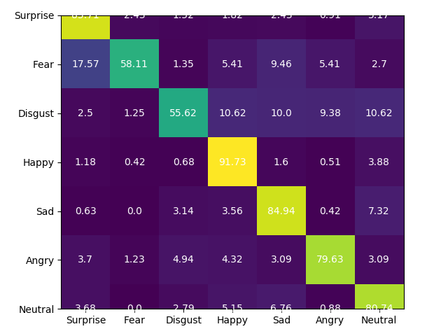

# Multi-task and Multi-level Feature Aggregation for Facial Expression Recognition
## Introduction
This repository holds the PyTorch implementation of MMNet in facial expression recognition (FER) field.

## Datasets
- [x] [FER2013](https://www.kaggle.com/c/challenges-in-representation-learning-facial-expression-recognition-challenge/data)
- [x] [RAF-DB](http://www.whdeng.cn/RAF/model1.html)

### Data Statistics
#### RAF-DB Basic
| Emotion | Num |
| :---: | :---: |
| 0 | 1619 |
| 1 | 355 |
| 2 | 877 |
| 3 | 5957 |
| 4 | 2460 |
| 5 | 867 |
| 6 | 3204 |

#### FER2013
| Emotion | Num |
| :---: | :---: |
| 0 | 3995 |
| 1 | 436 |
| 2 | 4097 |
| 3 | 7215 |
| 4 | 4830 |
| 5 | 3171 |
| 6 | 4965 |

    
## Performance
### RAF-DB  
| Weighted Sampling | Race | Gender | Age | Emotion | FER(Avg Confusion Matrix) |   
| :---: | :---: | :---: | :---: | :---: | :---: |    
| N | 0.8631 | 0.8217 | 0.7428 | 0.8302 | 0.7514  |
| N | 0.7663 | 0.5469 | 0.6281 | 0.8351 | 0.7457  |
| Y | 0.7663 | 0.7624 | 0.6004 | 0.8090 | 0.7600  |
| Y | 0.8638 | 0.8096 | 0.7396 | 0.8380 | 0.7710  |

### FER2013
| Weighted Sampling | Color | FA | Emotion Acc | Avg Confusion Matrix |
| :---: | :---: | :---: | :---: | :---: |
| N | RGB | Add | 69.13 | 67.39 |
| Y | RGB | Add | 69.18 | 67.24 |
| Y | Gray | Add | 69.95 | 68.09 |
| Y | Gray | Max | 70.08 | 68.96 |

### Ablation Study
| Aggregation Mode | FER |
| :---: | :---: |
| Elw Add + Random Sampling | 75.71 |
| Elw Avg + Weighted Sampling | 76.69 |
| Elw Add + Weighted Sampling | 77.10 |
| Elw Max + Weighted Sampling | 74.89 |
| Elw Min + Weighted Sampling | 75.75 |
| None + Weighted Sampling | 75.33 |

| Learning Fashion | Race | Gender | Age | FER(Avg Confusion Matrix) |
| :---: | :---: | :---: | :---: | :---: |
| Individual Learning | 86.15 | 82.56 | 73.79 | 73.43 |
| Multi-task Learning | 86.38 | 80.96 | 73.96 | 77.10 |

| emotion_branch_w | age_branch_w | race_branch_w | gender_branch_w | Emotion_AVG_CM |
| :---: | :---: | :---: | :---: | :---: |
| 1 | 1 | 1 | 1 | 0.7585 |
| 3 | 1 | 1 | 1 | 0.7710 |
| 4 | 1 | 1 | 1 | 0.7628 |